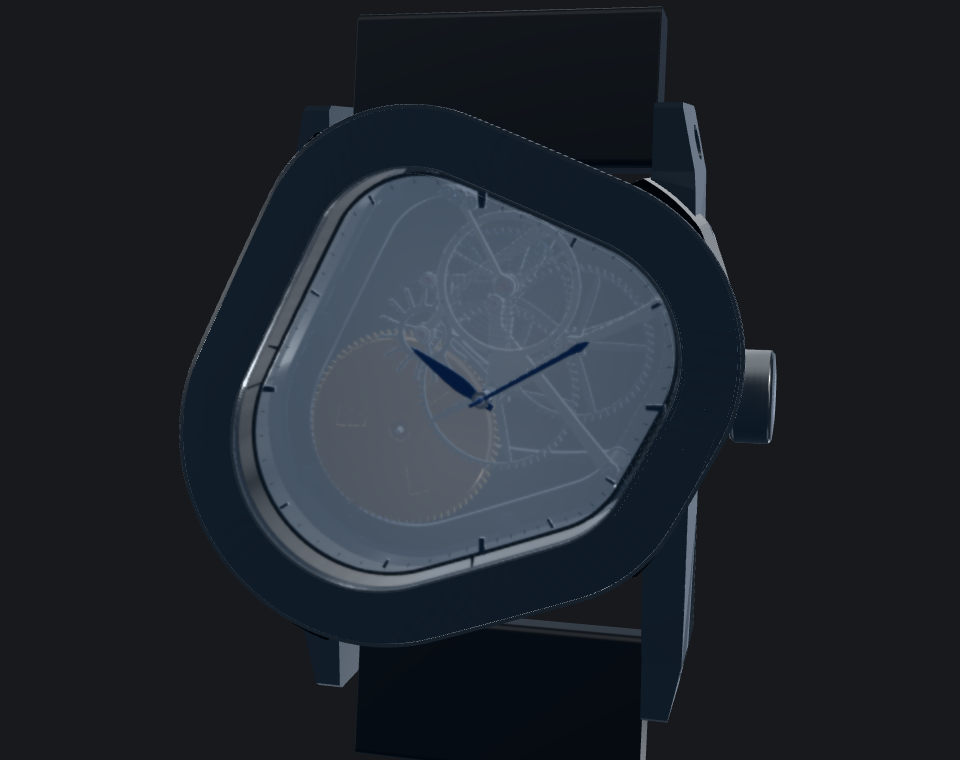

# 17280

An interactive study of an unsigned two-hand wristwatch with a translucent mist dial, built with
Three.js. **17280** is the movement rate: **2.4 Hz / 17,280 vibrations per hour**.

[Open the watch](https://charlesmish.github.io/17280/) ·
[Inspect the movement](https://charlesmish.github.io/17280/?dial=hidden) ·
[Close-up studio](https://charlesmish.github.io/17280/?film=balance) ·
[Explore the exploded view](https://charlesmish.github.io/17280/?view=r1E1Hero&explode=1)

[](https://charlesmish.github.io/17280/)

[Download the 2560 × 1440 PNG](https://charlesmish.github.io/17280/renders/17280-exploded-2560.png)
— archived exploded rendering of the earlier full-skeleton design, with corrected crystal and ruby optics.

The model combines a ratio-linked going train, lever escapement, blue hands,
a gold barrel, sapphire crystals, and a charcoal strap. It is a mechanically
informed visualization; see [known limitations](KNOWN_LIMITATIONS.md) for the
boundaries of the model.

## Explore

- Drag to orbit; scroll or pinch to zoom. **Hero, Front, Wearable and Rear** choose preset cameras.
- Switch between **Assembled** and **Exploded**. In Exploded, select a layer to highlight its parts.
- **Dial** switches between the 65%-opaque cool-mist sunburst and a clear movement inspection view. The continuous dial has no viewing apertures.
- **Crystal & rubies** offers translucent rubies, opaque rubies, or a hidden-crystal inspection view.
- Pause motion, reset the view, or use **Space**, **Home**, and **E**. Reduced-motion preferences are respected.

The close-up studio provides six camera moves, a timeline, and controls for
framing and filming. See [FILMING.md](FILMING.md) for deterministic PNG/MP4 export.
The [crown comparison](https://charlesmish.github.io/17280/films/crown/) preserves
matched before/after stills and orbits from the crown repair.

## Run locally

Requires Node.js `^20.19.0` or `>=22.12.0` and npm.

```sh
npm ci
npm run dev
```

Open <http://127.0.0.1:5173/>. To build and preview the static site:

```sh
npm run build
npm run preview
```

To check that no moving part passes through the fixed structure or another
moving part (no browser needed):

```sh
npm run audit:collisions
```

GitHub Pages builds `dist/` from `main`. The site needs no account, database,
backend, or external asset service at runtime. See [deployment notes](DEPLOYMENT.md).

To reproduce the exploded image while the local server is running:

```sh
node scripts/capture-exploded.mjs http://127.0.0.1:5173/ captures/exploded-hd
```

This saves a 960 × 540 preview, a native 2560 × 1440 PNG, and capture metadata.
It requires Playwright Chromium; the output directory must be new.

## Design and development notes

- [Mist dial and inspection control](DIAL.md)
- [Crystal and ruby rendering](OPTICS.md)
- [Graphite finish](GRAPHITE_FINISHING.md)
- [Crown shading repair](CROWN_REFINEMENT.md)
- [Historical engineering reviews](review/README.md)

Older closeout plans, review packets and release tools document earlier project
states. Some require local evidence that is excluded from Git. Generated checkpoint
bundles are kept in [history](review/checkpoints/graphite-sapphire/README.md);
the source and regression tools remain available.

## Rights and dependencies

CharlesMish's original software, watch design, rendered assets, and documentation
are available under the [MIT License](LICENSE), to the extent CharlesMish holds
the rights to them. This replaces the previous owner-controlled rights notice.
[PROJECT_LICENSE.txt](PROJECT_LICENSE.txt) contains the same MIT text for the
existing packaging tools.
Third-party software retains its own licenses; see [THIRD_PARTY_NOTICES.txt](THIRD_PARTY_NOTICES.txt).
The [dependency audit](SECURITY_AUDIT.md) records its date and scope.
